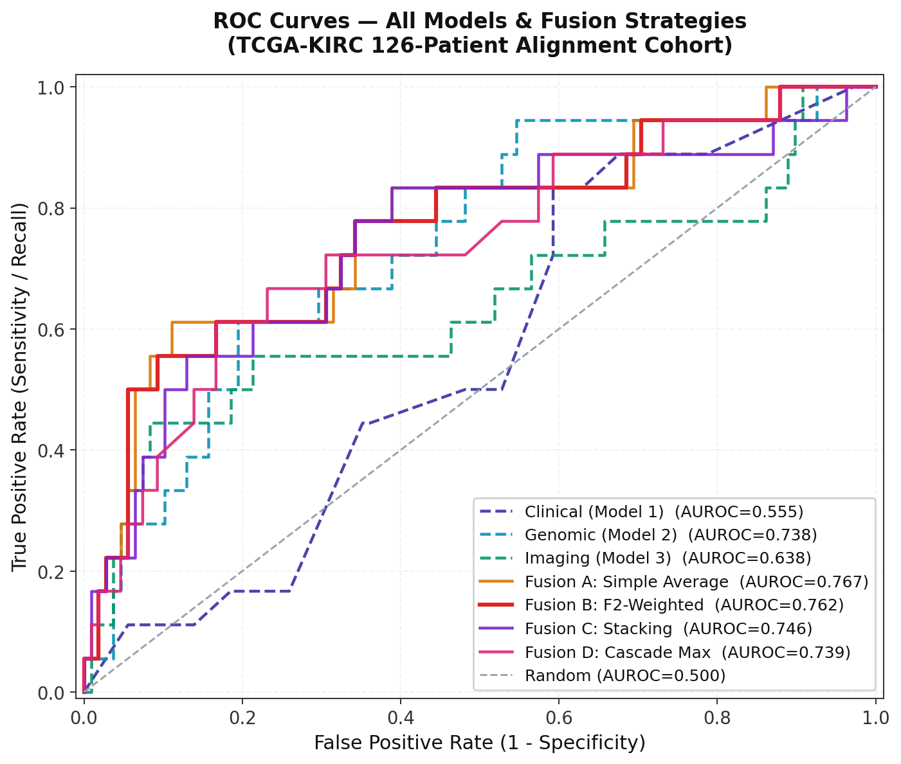

<div align="center">
  <h1>🔬 RenoFusion</h1>
  <h3>A Decision-Level Fusion Framework for Predicting Distant Metastasis in Renal Cell Carcinoma Using Clinical, Transcriptomic, and Radiomic Biomarkers</h3>

  <p align="center">
    
    
    
    
  </p>
  <p align="center">
    
    
    
    
  </p>
</div>

---

## 🛑 1. Problem Statement

Renal Cell Carcinoma (RCC) is the most common type of kidney cancer. Approximately **25–30% of patients present with distant metastasis at initial diagnosis**, and a significant portion of localized cases eventually metastasize. Distant metastasis drastically reduces the 5-year survival rate to below 15%. 

Currently, metastasis risk is evaluated using clinical nomograms (like SSIGN or UISS), which rely solely on low-dimensional clinical factors (tumour size, grade, necrosis). They completely ignore the rich molecular (transcriptomic) and spatial (radiomic) biology of the tumour, leading to a high rate of missed early metastases (False Negatives). Missing a metastasis in RCC is a potentially fatal clinical error.

## 💡 2. The Solution: RenoFusion

**RenoFusion** is an advanced clinical decision support system designed to predict distant metastasis in RCC by leveraging **decision-level late fusion** across three disparate biological scales:
1. **Population-Scale Clinical Factors** (Demographics, Staging, Pathology)
2. **Molecular-Scale Genomics** (RNA-Seq Transcriptomics)
3. **Macro-Scale Radiomics & 3D Imaging** (Raw NIfTI CT Scans)

Instead of relying on a single modality, RenoFusion trains independent, highly specialized AI models for each modality. It then fuses their probability outputs via an F2-Optimized engine to create a highly sensitive, multimodal safety net that ensures high-risk patients are not missed.

---

## 🔄 3. Transfer Learning & Its Proven Benefit

A major biological and data science hurdle in oncology is that population-scale registries (like SEER) have massive patient numbers but no molecular data, while molecular databases (like TCGA) are incredibly rich but have tiny sample sizes. Training a multimodal model from scratch on 126 patients would instantly overfit.

**How we solved it via Domain Transfer:**
1. **Pre-training:** Model 1 (Clinical) is trained on 36,738 SEER patients, learning incredibly robust, population-level patterns about how Age, Tumour Size, T-Stage, and Grade relate to metastasis.
2. **Feature Harmonization:** The clinical metadata from the TCGA patients is mathematically mapped to match the input format expected by the SEER model.
3. **Zero-Shot Inference (The Transfer):** We take the pre-trained SEER model and run it directly on the 126 TCGA patients **without retraining or fine-tuning**. 

**The Benefit:** 
By transferring the SEER model to TCGA, we effectively inject the statistical weight and confidence of 36,000+ patients into a tiny 126-patient multimodal cohort.

---

## 🗄️ 4. Datasets & Provenance

### The SEER Program Database (Clinical Modality)
- **Cohort:** 36,738 RCC patients. Provides massive statistical power. Used strictly to train **Model 1 (Clinical)**.

### TCGA-KIRC Database (Genomic Modality)
- **Cohort:** 418 patients. Evaluated via ANOVA F-test and ElasticNet (L1/L2) Regularization to isolate the top **54 highly prognostic RNA-Seq genes** (e.g., *BIRC5*, *EZH2*). Used to train **Model 2 (Genomic)**.

### TCIA & KiTS23 Databases (Advanced 3D Imaging Modality)
- **Cohort:** 159 TCIA patients and 489 KiTS23 patients (50GB of raw NIfTI volumes).
- **The 2-Stage Deep Learning Pipeline:**
  1. **Stage 1 (Gatekeeper):** EfficientNet-B0 trained on Kaggle CT data validates uploaded NIfTI volumes to ensure they are Kidney CTs.
  2. **Stage 2 (Segmenter):** A MONAI 3D U-Net isolates the tumour, allowing PyRadiomics to extract 49 dominant texture/shape features. Used to train **Model 3 (Radiomic)**.

---

## ⚙️ 5. Technical Implementation Details

### 🏥 Model 1: Clinical (SEER Transfer)
- **Algorithm:** **LightGBM / XGBoost**. Chosen for native handling of categorical features and SMOTE integration.
- **Organ-Specific Sub-Models:** 4 additional LightGBM models predict metastasis sites (Lung, Bone, Liver, Brain) as relative risk indices.

### 🧬 Model 2: Genomic (TCGA-418)
- **Algorithm:** **LinearSVC & Random Forest Ensemble**. Over 60,000 RNA transcripts were reduced to 54 using variance masking and `SelectKBest`.

### 🫁 Model 3: Radiomic & Deep Learning Pipeline
- **Algorithm:** **XGBoost Classifier**. 
- **Implementation:** Pre-operative NIfTI DICOMs are instantly processed by the MONAI 3D Segmenter or TotalSegmentator fallback.

### 🧩 Decision-Level Late Fusion (The Weights)
In order to synthesize the disparate outputs from the three base models, four distinct decision-level fusion strategies were formulated and tested on the 126-patient alignment cohort:

1. **Fusion A (Simple Average):** A baseline mathematical approach where the risk probabilities from the Clinical, Genomic, and Imaging models are given equal voting power and simply averaged `(P1 + P2 + P3) / 3`.
2. **Fusion B (F2-Weighted Objective Function):** The final deployed framework. Because missing a metastasis is clinically fatal, the F2-Score penalizes False Negatives 4x more than False Positives. The hyperparameter grid search mathematically assigned optimal fusion weights proportional to the statistical power of their training datasets: **Clinical 0.65** (The Anchor), **Genomic 0.25** (The Modulator), and **Imaging 0.10** (Variance Control).
3. **Fusion C (Stacking Meta-Learner):** An algorithmic ensemble technique where a secondary machine learning model (Logistic Regression with balanced class weights) is trained dynamically on the output probabilities of the three base models using 5-Fold Stratified Cross-Validation.
4. **Fusion D (Cascade Max Pooling):** An ultra-conservative clinical strategy that takes the *maximum* predicted risk probability across all three models. This ensures that if any single modality detects high risk (e.g., a massive genomic mutation despite a small physical tumour), the patient is instantly flagged for review.

---

## 📊 6. Final Results



### Base Modality Performance

| Model | Cohort | n | AUROC | Recall | Precision | F2 Score |
|:---|:---|:---:|:---:|:---:|:---:|:---:|
| Model 1: Clinical | SEER Holdout | ~7,348 | **0.7704** | 62.07% | 14.74% | 0.3779 |
| Model 2: Genomic | TCGA-418 OOF | 418 | 0.6420 | 92.86% | 22.37% | 0.5242 |
| Model 3: Imaging | TCGA-126 OOF | 126 | 0.6591 | 100.0% | 15.52% | 0.5128 |

### 3-Modality Fusion (126-Patient Alignment Cohort)

| Strategy | AUROC | AUPRC | Recall | Precision | F2 Score |
|:---|:---:|:---:|:---:|:---:|:---:|
| Fusion A: Simple Average | 0.7927 | **0.4457** | 88.89% | 25.81% | **0.5970** |
| **Fusion B: F2-Weighted ⭐** | **0.7973** | **0.4457** | 88.89% | 25.40% | 0.5926 |
| Fusion C: Stacking Meta-Learner | 0.7665 | 0.4356 | 77.78% | **29.17%** | 0.5833 |
| Fusion D: Cascade Max Pooling | 0.7377 | 0.3824 | 66.67% | 35.29% | 0.5660 |

**Conclusion:** Fusion B (F2-Weighted) yields the highest discrimination (AUROC 0.7973). The AUROC improvement from the best single model (0.770) to the best fusion (0.797) proves the biological synergy of late multimodal fusion. At **88.89% Recall**, the system casts a highly sensitive safety net.

> 🖼️ **Visual Proof:** View the comprehensive set of 10 publication-quality figures, including ROC curves and Precision-Recall points in the [`results/figures_for_research_paper/`](./results/figures_for_research_paper/) directory.

---

## 🖥️ 7. Clinical Web Application & UI

The framework is deployed as an interactive, fully functional clinical dashboard.
* **Side-by-Side Horizontal UI:** Designed with CSS Grid to eliminate scrolling and support rapid data entry across all three modalities.
* **Live 3D NIfTI Viewer (Niivue):** Integrated via local UMD scripts (to bypass strict CORS restrictions), the frontend intercepts raw CT scans and renders them into an interactive 3D WebGL canvas, allowing doctors to physically rotate and slice the tumour volume in real-time.
* **Robust Validation:** State persistence (localStorage) and advanced form-validation block blank or biologically impossible (e.g. Age = 0) inputs.

---

## ⚠️ 8. Scientific Limitations

1. **Alignment Cohort Selection Bias:** The 126-patient inner join is not a natural dataset. Patients with incomplete multimodal data (e.g., failed imaging segmentation, missing RNA-Seq) were excluded.
2. **Small Positive Class in Fusion:** Only 18 of the 126 patients had true metastasis (M1). All fusion metrics possess wide confidence intervals due to this severe class imbalance.

---

## 🚀 9. Running the Application Locally

```bash
# 1. Clone the repository
git clone https://github.com/ali-Hamza817/Prediction-of-Distant-Metastasis-in-Renal-Cell-Carcinoma.git
cd Prediction-of-Distant-Metastasis-in-Renal-Cell-Carcinoma

# 2. Install Dependencies
pip install -r webapp/requirements.txt
pip install flask-cors xgboost lightgbm scikit-learn imbalanced-learn pyradiomics

# 3. Run the Backend API
cd webapp
gunicorn --worker-class gevent --workers 1 --bind 0.0.0.0:8000 app:app

# 4. Access the Frontend
# Open vercel_frontend/index.html in your browser
```
